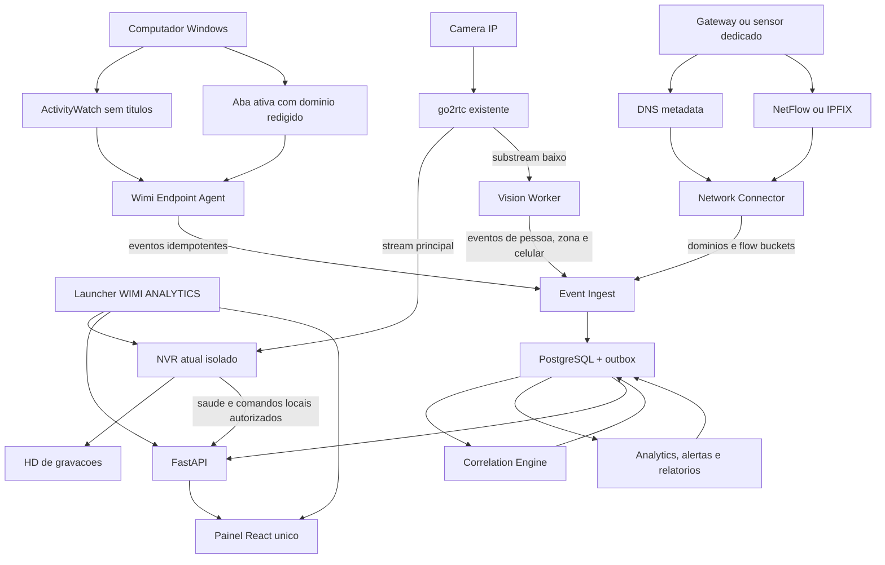

# Wimi Analytics - pesquisa, arquitetura unificada e MVP

## Estado de implementacao em 15/08/2026

A primeira fundacao funcional foi implementada no mesmo repositorio, sem mover
ou substituir o NVR. Ela inclui processo HTTP local separado, bridge sanitizada
do snapshot de saude, sessao de navegador, supervisor single-instance, botao no
Tkinter e dashboard com todas as rotas planejadas. O detalhe executavel esta em
`docs/WIMI_ANALYTICS_IMPLEMENTATION_2026-08-15.md`.

Essa entrega nao ativa detector, tracking, agente Windows, DNS/flows da loja,
banco ou score de produtividade. O painel possui apenas diagnostico local e
somente leitura da interface, IPv4, gateway e DNS configurado neste PC, sem
varredura ou captura de trafego. Os demais componentes permanecem explicitamente
marcados como nao configurados ate as etapas de benchmark, governanca e teste
real.

Data da pesquisa: 15/08/2026

## Parecer executivo

O produto e tecnicamente viavel, mas nao deve ser incorporado ao processo do
NVR atual. A gravacao e o analytics possuem perfis de falha e consumo muito
diferentes. A arquitetura recomendada preserva o NVR como fonte de video e
gravador, enquanto um servico separado consome apenas um substream de baixa
resolucao, descarta quadros atrasados e publica eventos resumidos.

Decisoes principais:

1. Evoluir este repositorio para um monorepo `WIMI ANALYTICS`, com um launcher e
   um painel unicos, preservando processos separados para NVR, visao, endpoint,
   rede, API e relatorios.
2. Preservar integralmente a gravacao direta do NVR via go2rtc.
3. Comecar com identificadores anonimos de tracking, sem reconhecimento facial.
4. Usar ActivityWatch para aplicativo ativo e AFK, removendo titulos de janelas.
5. Coletar rede por DNS/flows exportados por um gateway ou sensor dedicado, sem
   interceptar HTTPS e sem transformar o NVR em firewall ou servidor DNS.
6. Nao armazenar quadros, rostos, teclas digitadas, tela, mensagens ou payloads
   de rede.
7. Persistir sessoes e transicoes, nao uma linha de banco por quadro, pacote ou
   consulta repetida.
8. Tratar alertas como evidencias para revisao humana, nunca como prova de ma
   conduta ou produtividade.
9. Executar o MVP a 3-5 FPS em substream, com fila limitada e queda de quadros.
10. Manter banco, eventos e temporarios fora do HD `D:` usado pelas gravacoes.
11. Usar PostgreSQL com outbox no MVP; adicionar NATS somente se o volume real
    justificar um barramento dedicado.
12. Fazer reconhecimento facial apenas como fase opcional, depois de RIPD,
    definicao de base legal, controles de acesso, retencao e teste de vieses.

O sistema pode ser detalhado, mas nao deve ser secreto. Monitoramento oculto,
keylogger, captura de tela e analise de conversas ampliariam muito o risco sem
ser necessarios para os indicadores operacionais solicitados.

## Encaixe no NVR existente

O NVR atual usa go2rtc e grava o fluxo `/api/stream.ts?src=NOME` sem
transcodificacao continua. O analytics nao deve alterar esse caminho, ler os
arquivos gravados, compartilhar temporarios ou escrever no disco de videos.

Integracao segura:

```text
Camera IP
  |-- stream principal --> go2rtc --> NVR atual --> HD de gravacoes
  `-- substream baixo ----> go2rtc --> Vision Worker --> eventos resumidos
```

Regras de isolamento:

- uma conexao de analytics por camera, preferencialmente no substream;
- `640x360` ou resolucao semelhante no MVP;
- fila de no maximo dois quadros; quadro antigo e descartado;
- o NVR sempre tem prioridade sobre inferencia, relatorios e manutencao;
- falha do analytics nunca reinicia go2rtc, NVR, camera ou Windows;
- nenhuma credencial RTSP e copiada para o banco ou frontend;
- saude do analytics e saude da gravacao aparecem separadas;
- se CPU, memoria, GPU ou disco excederem limites, para-se a inferencia, nao a
  gravacao.

## Um projeto e um painel, com isolamento interno

"Tudo no mesmo projeto" deve significar uma experiencia unica para o usuario,
nao um unico processo gigante. O launcher inicia os componentes necessarios e
abre um dashboard React com as rotas `Cameras`, `Analytics`, `Computadores`,
`Rede`, `Timeline`, `Relatorios` e `Sistema`.

O `gerenciador.pyw` continua sendo o dono da gravacao. Ele publica apenas saude
e comandos locais autorizados por uma ponte estreita. O painel nao acessa
threads, arquivos temporarios ou memoria interna do gravador. Vision Worker,
Network Connector, API e Report Worker sao processos filhos supervisionados,
com restart, limites e logs independentes.

Assim, ao abrir o aplicativo tudo aparece no mesmo painel, mas uma falha em
heatmap, relatorio, DNS ou inferencia nao interrompe gravacao, internet ou
visualizacao das cameras. Componentes de terceiros nao sao copiados para dentro
do codigo: sao integrados por API, arquivos de eventos ou protocolos documentados.

## Pesquisa GitHub

As estrelas sao aproximadas e mudam diariamente. A coluna "ultimo push" usa o
campo `pushed_at` da API publica do GitHub consultada em 15/08/2026. Licenca
permissiva nao elimina a necessidade de preservar avisos, revisar modelos e
validar dependencias transitivas.

### Recomendados

| Classificacao | Repositorio | Stars | Ultimo push | Linguagem / licenca | Qualidade e funcao | Uso comercial e reaproveitamento |
|---|---:|---:|---:|---|---|---|
| Verde - recomendado | [OpenCV](https://github.com/opencv/opencv) | ~90,5k | 15/08/2026 | C++ / Apache-2.0 | Muito alta. Captura, geometria, desenho de zonas e pre-processamento. | Compativel com produto comercial; usar captura, conversao de quadros e operacoes geometricas. |
| Verde - recomendado | [Supervision](https://github.com/roboflow/supervision) | ~49,4k | 14/08/2026 | Python / MIT | Alta e ativa. Inclui ByteTrack, `PolygonZone`, anotadores e utilitarios. | Excelente para tracking e zonas sem copiar implementacoes academicas antigas. |
| Verde - recomendado | [ONNX Runtime](https://github.com/microsoft/onnxruntime) | ~21,4k | 15/08/2026 | C++ / MIT | Muito alta. Inferencia portavel em CPU, CUDA e outros provedores. | Camada principal de inferencia; permite trocar o modelo sem reescrever o pipeline. |
| Verde - recomendado | [RF-DETR](https://github.com/roboflow/rf-detr) | ~9,0k | 15/08/2026 | Python / Apache-2.0 | Alta e muito ativa. Detector moderno com variantes pequenas e exportacao. | Avaliar `Nano` no MVP. Usar apenas pacote e pesos explicitamente Apache; excluir componentes `Plus` sob PML. |
| Verde - recomendado | [ActivityWatch](https://github.com/ActivityWatch/activitywatch) | ~18,6k | 06/08/2026 | Python / MPL-2.0 | Muito alta. Aplicativo ativo, AFK, API heartbeat, consultas e dashboard de referencia. | Comercialmente utilizavel com obrigacoes MPL nos arquivos cobertos. Reusar watchers e semantica de heartbeat. |
| Verde - recomendado | [aw-watcher-window](https://github.com/ActivityWatch/aw-watcher-window) | ~127 | 28/07/2026 | Python / MPL-2.0 | Alta dentro do ecossistema ActivityWatch. Coleta janela ativa no Windows. | Reusar com `exclude_titles` para nao coletar nomes de pacientes, documentos, conversas ou paginas. |
| Verde - recomendado | [OpenVINO](https://github.com/openvinotoolkit/openvino) | ~10,7k | 14/08/2026 | C++ / Apache-2.0 | Muito alta. Otimiza inferencia em CPU, iGPU e NPU Intel. | Provedor alternativo para computadores sem NVIDIA; confirmar AVX2 e versao compativel. |

### Uteis com ressalvas

| Classificacao | Repositorio | Stars | Ultimo push | Linguagem / licenca | Qualidade e funcao | Ressalva |
|---|---:|---:|---:|---|---|---|
| Amarelo - util | [Frigate](https://github.com/blakeblackshear/frigate) | ~35,1k | 15/08/2026 | TypeScript / MIT | Muito alta. NVR local, movimento, deteccao, zonas, restream e editor visual. | Nao instalar como segundo NVR no PC atual. Reusar ideias de motion gating, zonas e UX; avaliar servico separado apenas em Linux dedicado. |
| Amarelo - util | [ByteTrack](https://github.com/FoundationVision/ByteTrack) | ~6,6k | 19/06/2024 | Python / MIT | Referencia academica forte para MOT. | Repositorio original recebe poucos pushes. Preferir a implementacao mantida no Supervision. |
| Amarelo - util | [Norfair](https://github.com/tryolabs/norfair) | ~2,7k | 30/04/2025 | Python / BSD-3-Clause | Boa, leve e modular; aceita detectores diversos e reidentificacao opcional. | Alternativa ao ByteTrack se os testes locais mostrarem melhor estabilidade em baixo FPS. |
| Amarelo - util | [MediaPipe](https://github.com/google-ai-edge/mediapipe) | ~36,6k | 12/08/2026 | C++ / Apache-2.0 | Muito alta para pose e landmarks. | Nao e necessario no MVP. Pose nao prova atendimento ou produtividade e aumenta custo de GPU. |
| Amarelo - util | [PaddleDetection](https://github.com/PaddlePaddle/PaddleDetection) | ~14,4k | 28/05/2026 | Python / Apache-2.0 | Alta, completa e industrial, com deteccao, tracking e pose. | Ecossistema maior e mais pesado; manter como alternativa se RF-DETR nao atender. |
| Amarelo - util | [YOLOX](https://github.com/Megvii-BaseDetection/YOLOX) | ~10,6k | 08/06/2025 | Python / Apache-2.0 | Boa, rapida e com exportacao ONNX/OpenVINO. | O codigo e Apache, mas ha uma questao aberta sobre termos dos pesos oficiais. So usar pesos com licenca confirmada. |
| Amarelo - util | [DeepStream reference apps](https://github.com/NVIDIA-AI-IOT/deepstream_reference_apps) | ~1,4k | 15/07/2026 | C++ / licenca nao detectada pela API | Muito bom para muitas cameras em GPU NVIDIA/Jetson. | Complexidade e dependencia de Linux/NVIDIA excessivas para uma camera no Windows. Revisar termos do SDK e de cada exemplo. |
| Amarelo - util | [CompreFace](https://github.com/exadel-inc/CompreFace) | ~8,2k | 05/10/2024 | Java / Apache-2.0 | API local pronta para reconhecimento facial via Docker. | Ultimo release publico antigo e custo operacional alto. Somente prova controlada depois da governanca biometrica. |

### Nao recomendados para o produto comercial inicial

| Classificacao | Repositorio | Stars | Ultimo push | Linguagem / licenca | Motivo |
|---|---:|---:|---:|---|---|
| Vermelho - nao usar por padrao | [Ultralytics](https://github.com/ultralytics/ultralytics) | ~60,6k | 15/08/2026 | Python / AGPL-3.0 | Excelente tecnicamente, mas um produto proprietario precisa cumprir AGPL ou adquirir licenca Enterprise. Nao assumir que `pip install` autoriza integracao fechada. |
| Vermelho - nao usar por padrao | [BoxMOT](https://github.com/mikel-brostrom/boxmot) | ~8,3k | 13/08/2026 | Python / AGPL-3.0 | Muito ativo e completo, mas traz o mesmo risco de copyleft forte para o produto. |
| Vermelho - nao usar | [Deep SORT](https://github.com/nwojke/deep_sort) | ~6,2k | 02/03/2025 | Python / GPL-3.0 | Implementacao de referencia importante, mas antiga e com GPL. Supervision/ByteTrack ou Norfair sao melhores escolhas. |
| Vermelho - nao usar pesos padrao | [InsightFace](https://github.com/deepinsight/insightface) | ~29,5k | 27/07/2026 | Python / licenca dividida | O codigo e MIT, mas os modelos fornecidos sao declarados apenas para pesquisa nao comercial e exigem licenciamento separado. |

### Rede, DNS, flows e barramento

| Classificacao | Repositorio | Stars | Ultimo push | Linguagem / licenca | Finalidade, integracao e limitacoes |
|---|---:|---:|---:|---|---|
| Verde - recomendado | [OPNsense Core](https://github.com/opnsense/core) | ~4,6k | 14/08/2026 | PHP / BSD-2-Clause | Gateway/firewall com API e NetFlow/Insight. Melhor base para uma appliance dedicada futura. Nao instalar no PC do NVR nem mudar o gateway durante o MVP inicial. |
| Verde - recomendado quando houver exportador | [GoFlow2](https://github.com/netsampler/goflow2) | ~803 | 16/06/2026 | Go / BSD-3-Clause | Coletor leve de NetFlow, IPFIX e sFlow. Reaproveitar decoder/formato para receber flows de roteador compativel; nao fornece armazenamento, categoria ou dashboard pronto. |
| Verde - recomendado com redacao | [aw-watcher-web](https://github.com/ActivityWatch/aw-watcher-web) | ~557 | 04/08/2026 | TypeScript / MPL-2.0 | Detecta aba ativa no navegador. Reaproveitar a extensao/heartbeat, mas enviar somente dominio registravel e estado ativo; remover URL completa, caminho, query e titulo antes de persistir. |
| Amarelo - avaliar no MVP de DNS | [AdGuard Home](https://github.com/AdguardTeam/AdGuardHome) | ~36,1k | 14/08/2026 | TypeScript/Go / GPL-3.0 | DNS local multiplataforma, logs e API. Pode funcionar como servico externo, sem incorporar codigo GPL ao produto. Se ele falhar como DNS, a internet pode falhar; exige host dedicado, redundancia e rollback. |
| Amarelo - alternativa Linux | [Pi-hole](https://github.com/pi-hole/pi-hole) | ~60,4k | 04/08/2026 | Shell / EUPL-1.2 | DNS sinkhole maduro com API e clientes. Excelente referencia, mas requer Linux/container e mudanca de DNS da rede; AdGuard Home e mais simples no piloto Windows. |
| Amarelo - analise avancada | [Zeek](https://github.com/zeek/zeek) | ~7,9k | 14/08/2026 | C++ / BSD | Gera logs semanticos ricos de DNS, conexoes e TLS em sensor passivo. Muito util em fase posterior com porta espelhada ou gateway dedicado; excessivo para o primeiro MVP. |
| Amarelo - dashboard externo | [ntopng](https://github.com/ntop/ntopng) | ~8,1k | 15/08/2026 | Lua/C++ / GPL-3.0 | NetFlow, IPFIX, sFlow, hosts e aplicacoes com painel pronto. Integrar como fonte externa por API; edicao Community, limites e licenca devem ser verificados antes de distribuir. |
| Amarelo - alternativa de gateway | [pfSense](https://github.com/pfsense/pfsense) | ~5,7k | 31/03/2026 | PHP / Apache-2.0 | Firewall maduro e possivel fonte de flows. OPNsense foi escolhido para o desenho inicial por licenca simples, API e integracao aberta; nao ha motivo para operar os dois. |
| Amarelo - somente apos escala | [NATS Server](https://github.com/nats-io/nats-server) | ~20,5k | 15/08/2026 | Go / Apache-2.0 | Barramento leve com JetStream. Bom para varias lojas e muitos workers, mas adiciona estado, disco e recuperacao. PostgreSQL outbox basta no MVP. |
| Vermelho - fora do MVP | [Suricata](https://github.com/OISF/suricata) | ~6,5k | 14/08/2026 | C / GPL-2.0 | IDS/IPS/NSM excelente para seguranca, mas nao mede produtividade. Captura profunda aumenta custo e dados sensiveis; manter como projeto de seguranca separado e passivo se adotado. |
| Vermelho - fora do produto inicial | [Akvorado](https://github.com/akvorado/akvorado) | ~2,3k | 15/08/2026 | Go / AGPL-3.0 | Coletor e visualizador de flows robusto, porem grande para a loja, dependente de infraestrutura adicional e com AGPL. |

## Stack definitiva proposta

| Componente | Escolha | Motivo |
|---|---|---|
| Ingestao de camera | go2rtc existente, substream somente leitura | Nao cria nova fonte de credenciais e preserva a gravacao atual. |
| Vision Worker | Python isolado | Melhor ecossistema para OpenCV, ONNX e tracking; processo pode ser encerrado sem afetar o NVR. |
| Detector inicial | RF-DETR Nano, pesos Apache-designados, exportado para ONNX | Licenca mais adequada ao produto e modelo pequeno para teste em GPU de 4 GB. |
| Inferencia | ONNX Runtime com adaptadores CUDA, DirectML e CPU | Permite GPU NVIDIA e fallback sem acoplar o dominio a um fornecedor. |
| Tracking | Supervision ByteTrack | Implementacao ativa, MIT e integrada a estruturas de deteccao e zonas. |
| Zonas | Supervision `PolygonZone` + histerese propria | Base pronta; a regra de negocio ainda precisa usar tempo real e tolerar bordas. |
| Telemetria de apps | ActivityWatch `aw-watcher-window` + `aw-watcher-afk` | Evita reinventar coleta de janela ativa e ociosidade. |
| Eventos Windows ausentes | Pequeno Windows Service em .NET LTS | Captura lock/unlock, login/logout, fila offline e envio autenticado. |
| Aba ativa | `aw-watcher-web` adaptado para enviar somente eTLD+1 | Melhora a confianca de uso de sites sem guardar URL, busca, titulo ou conteudo. |
| DNS no piloto | Conector para AdGuard Home externo | API local simples e multiplataforma; nunca roda dentro do processo do NVR. |
| Flows de rede | OPNsense exportando NetFlow/IPFIX para GoFlow2 | Acrescenta bytes, pacotes e conexoes por dispositivo sem inspecionar payload. |
| Classificacao de dominio | Regras locais versionadas por eTLD+1 | Resultado auditavel, corrigivel e independente de servico de nuvem. |
| Backend | FastAPI + SQLAlchemy/Alembic | Contratos claros, validacao, WebSocket e alinhamento com o worker Python. |
| Banco | PostgreSQL | Integridade, indices, JSONB controlado, agregacoes e crescimento para varias lojas. |
| Eventos no MVP | PostgreSQL outbox + worker com lease | Evita Redis, Kafka e NATS no inicio; ingestao, correlacao e relatorios continuam idempotentes. |
| Barramento futuro | NATS JetStream | Adotar apenas se testes mostrarem que outbox e PostgreSQL nao atendem varias lojas/workers. |
| Correlacao | Motor deterministico com regras versionadas | Une evidencias por intervalos, dispositivo, zona e confianca sem IA opaca. |
| Anomalias | Mediana, MAD e EWMA com cobertura minima | Explicavel, resistente a extremos e auditavel; nao gera alerta sem historico suficiente. |
| Frontend | React + TypeScript + Vite | Painel local nao precisa SSR/SEO do Next.js; menor complexidade operacional. |
| Graficos | ECharts | Bom suporte a timeline, barras empilhadas e heatmaps operacionais. |
| Desktop | Launcher/supervisor + webview ou navegador local | Um clique e um painel, mantendo servicos com ciclos de vida e limites separados. |
| Implantacao | Mesmo monorepo, processos separados; Compose somente no servidor dedicado | No PC atual, containers adicionais competiriam com o NVR e a RAM disponivel. |

O detector deve ficar atras de uma interface. Antes de fixa-lo, executar o
mesmo conjunto de videos de validacao em RF-DETR Nano, YOLOX Nano com pesos
legalmente confirmados e uma opcao OpenVINO. A decisao final usa precisao local,
latencia, memoria, temperatura e licenca, nao apenas benchmark publico.

## Arquitetura recomendada



### Fluxo de visao

1. O worker le o substream e mantem apenas o quadro mais recente.
2. O detector localiza pessoas em 3-5 FPS.
3. O tracker gera um identificador efemero por camera.
4. As coordenadas do ponto dos pes sao comparadas com zonas normalizadas.
5. Histerese evita entrar e sair repetidamente na borda.
6. O worker cria sessoes de zona e movimento usando relogio monotonicamente
   crescente; FPS nao e usado para calcular duracao.
7. Apenas inicio, heartbeat resumido, mudanca de zona, fim e saude sao enviados.
8. O backend deduplica pelo `source_event_id`.

### Fluxo do computador

1. ActivityWatch coleta aplicacao ativa e AFK localmente.
2. `exclude_titles` remove titulos de janela antes da persistencia/exportacao.
3. O agente complementa lock/unlock, login/logout e identidade do dispositivo.
4. Eventos sao agregados em segmentos contiguos por aplicacao/categoria.
5. Em queda de rede, o agente usa fila local limitada, criptografada e com TTL.
6. O backend recebe lotes assinados e idempotentes.

### Fluxo da rede

1. O gateway ou DNS dedicado observa metadados; o NVR nao captura pacotes.
2. DNS e normalizado para dominio registravel, removendo caminho, query e payload.
3. NetFlow/IPFIX e agregado por dispositivo, destino, protocolo e janela de tempo.
4. DHCP/ARP ou cadastro administrativo associa IP a dispositivo com vigencia.
5. Regras locais versionadas classificam dominios em operacional, mensagens,
   rede social, video, fornecedor ou desconhecido.
6. O conector envia `DNS_DOMAIN_OBSERVED` e `NETWORK_FLOW_BUCKET` em lotes.
7. A indisponibilidade do conector cria lacuna; nunca bloqueia internet.
8. PCAP, payload, senha, cookie, mensagem e conteudo HTTPS nao sao persistidos.

### Correlacao multimodal

A correlacao deve ser explicitamente probabilistica:

- a zona do computador deve conter exatamente uma pessoa por uma janela minima;
- a maquina deve estar desbloqueada e com atividade recente;
- o horario dos dispositivos deve estar sincronizado;
- sobreposicao de duas pessoas, oclusao ou camera offline gera `inconclusivo`;
- o resultado guarda evidencias, confianca e versao da regra;
- rede sozinha confirma atividade tecnica do dispositivo, nao atencao humana;
- dominio + navegador ativo aumenta a confianca; aba ativa redigida e presenca na
  zona aumentam novamente, sem tornar a inferencia uma certeza;
- intervalos sobrepostos sao unidos por fonte/entidade para impedir dupla soma;
- nunca converter automaticamente correlacao em registro de ponto ou sancao.

## Identidade e reconhecimento facial

### Recomendacao para o MVP

Usar `anonymous_track_id` e, quando necessaria a atribuicao a uma pessoa,
combinar uma destas fontes menos invasivas:

- login do Windows em computador individual;
- escala/turno informado no sistema;
- cracha QR/NFC apresentado no inicio do turno;
- associacao manual revisavel no dashboard.

Um ID de tracking nao e uma identidade permanente. Ele pode mudar apos oclusao,
reinicio, mudanca de camera ou ausencia longa. O sistema deve somar sessoes com
essa incerteza explicita.

### Fase biometrica opcional

Reconhecimento facial so entra depois de:

1. RIPD documentado;
2. finalidade e hipotese legal validadas por profissional responsavel;
3. aviso claro aos titulares e canal de exercicio de direitos;
4. alternativa operacional nao biometrica;
5. embeddings criptografados e separados do banco operacional;
6. nenhum recorte facial persistido por padrao;
7. teste de falso positivo, falso negativo e vies por pessoa/iluminacao;
8. limiar conservador e resultado `desconhecido` como comportamento normal;
9. revisao humana antes de qualquer associacao;
10. politica de exclusao ao fim do vinculo e auditoria de acesso.

Biometria facial vinculada a uma pessoa natural e dado pessoal sensivel pela
LGPD. A ANPD tambem destaca risco de erro, discriminacao, falta de transparencia
e seguranca. Portanto, "funcionar localmente" reduz exposicao, mas nao elimina
as obrigacoes de finalidade, necessidade, transparencia, seguranca e prevencao.

## WhatsApp pessoal versus corporativo

Somente o nome do aplicativo em primeiro plano nao revela a finalidade do uso.
Se a mesma conta ou o mesmo executavel serve para conversas pessoais e da
farmacia, nao existe classificacao tecnica confiavel sem analisar conteudo.

Solucao recomendada:

1. usar WhatsApp Business corporativo em dispositivo ou perfil de navegador
   gerenciado e separado;
2. classificar pelo dispositivo, perfil e aplicativo, nao pelo texto da conversa;
3. marcar sessoes fora desse contexto como `WhatsApp - nao classificado`;
4. permitir correcao manual e registrar quem alterou a classificacao;
5. nunca capturar mensagens, contatos, notificacoes, teclas ou tela.

Uma regra que diga "WhatsApp aberto = uso pessoal" e tecnicamente falsa. O
dashboard deve mostrar tempo observado e contexto conhecido, sem inferir motivo.

## Celular fisico

Detectar um telefone pequeno na mao por camera de teto e suscetivel a oclusao,
distancia e falsos positivos. No MVP, incluir apenas um experimento opcional de
`POSSIBLE_PHONE_USAGE`, usando deteccao persistente de `person + cell phone`,
proximidade da caixa do telefone com maos/parte superior da pessoa, janela
temporal e intervalo de graca.

O recurso so sai de `experimental` depois de atingir criterios medidos em videos
da camera real. Cada evento guarda modelo, versao, confianca, camera, track,
inicio, fim e qualidade da observacao. Deteccoes intermitentes nao sao
preenchidas como uso continuo, e o total e apresentado como `estimativa de
possivel uso`, sempre revisavel.

## Modelo de eventos

Todo produtor publica o mesmo envelope, independentemente de camera, Windows ou
rede:

| Campo | Regra |
|---|---|
| `event_id` | UUIDv7 gerado na origem e imutavel. |
| `event_type` | Nome estavel como `PERSON_ENTER_ZONE`. |
| `schema_version` | Permite evoluir payload sem reinterpretar historico. |
| `occurred_at` | Horario UTC do acontecimento. |
| `observed_at` | Horario UTC em que a fonte conseguiu observa-lo. |
| `source_type/source_id` | Camera, endpoint, DNS, flow collector ou regra. |
| `store_id` | Loja responsavel pelo evento. |
| `subject_type/subject_id` | Track anonimo, pessoa, dispositivo ou sessao. |
| `sequence` | Sequencia monotona por fonte para detectar lacunas. |
| `idempotency_key` | Unico por fonte; reenvio nao duplica tempo. |
| `confidence` | `0..1`, acompanhado do metodo e qualidade. |
| `correlation_id` | Liga evidencias que formaram a mesma sessao/inferencia. |
| `rule_version/model_version` | Reproduz calculo, categoria e modelo. |
| `payload` | Somente campos permitidos pelo schema e ja redigidos. |

Eventos principais:

```text
PERSON_DETECTED
PERSON_ENTER_ZONE
PERSON_EXIT_ZONE
PERSON_STATIONARY
PERSON_MOVING
POSSIBLE_PHONE_USAGE
PC_LOGIN
PC_LOGOUT
PC_LOCKED
PC_UNLOCKED
APPLICATION_ACTIVE
ACTIVE_TAB_DOMAIN
DNS_DOMAIN_OBSERVED
NETWORK_FLOW_BUCKET
DEVICE_CONNECTED
DEVICE_DISCONNECTED
NETWORK_SESSION_ESTIMATED
MULTIMODAL_ACTIVITY_CORRELATED
ANOMALY_CANDIDATE
ALERT_CREATED
```

`DOMAIN_ACCESSED` nao e usado para DNS puro, pois uma consulta nao prova acesso.
`DNS_DOMAIN_OBSERVED` descreve corretamente o fato medido.

## Modelo de dados

Todos os horarios devem ser `timestamptz` em UTC. Poligonos usam coordenadas
normalizadas de `0.0` a `1.0`. Identificadores externos usam UUID e toda ingestao
possui chave de idempotencia.

### Cadastros

- `employees`: pessoa, situacao e referencia interna; sem biometria.
- `devices`: computador, agente, loja, versao e ultima comunicacao.
- `cameras`: nome logico e referencia ao stream; sem URL/credencial no banco.
- `zones`: camera, nome, poligono, tipo, versao e vigencia.
- `shifts`: escala planejada, inicio, fim e origem.
- `app_categories`: regra versionada que agrupa processos em categorias.
- `network_sensors`: gateway, DNS ou coletor, capacidade e ultima comunicacao.
- `device_identity_history`: IP, MAC, hostname, origem e intervalo de validade.
- `domain_categories`: eTLD+1, categoria, contexto e versao da regra.

### Eventos e sessoes

- `source_events`: envelope idempotente, origem, sequencia, horario e payload
  minimo; retencao curta.
- `track_sessions`: tracking anonimo por camera, inicio, fim e qualidade.
- `presence_sessions`: intervalo detectado e nivel de confianca.
- `zone_sessions`: entrada, saida, duracao, zona e qualidade.
- `movement_segments`: movendo/parado/desconhecido, sem coordenadas por quadro.
- `computer_sessions`: login, unlock, lock, logout e estado do dispositivo.
- `app_usage_segments`: processo normalizado, categoria, inicio, fim e origem.
- `active_domain_segments`: dominio registravel ativo, navegador e cobertura.
- `dns_observations`: dominio registravel observado e cliente; retencao curta.
- `network_flow_buckets`: bytes, pacotes e conexoes agregados por intervalo.
- `network_sessions`: sessionizacao estimada, fontes e confianca.
- `identity_links`: associacao revisavel entre tracking e pessoa, com metodo e
  confianca.
- `correlation_events`: sobreposicao camera-computador-rede e evidencias.
- `device_health`: fila, latencia, memoria, CPU/GPU, frames descartados e erros.

### Resultados e governanca

- `alerts`: regra, evidencia, estado de revisao e responsavel.
- `daily_metrics`: agregados diarios reproduziveis e versao do calculo.
- `metric_baselines`: mediana, MAD, EWMA, cobertura e janela de referencia.
- `reports`: periodo, versao, status e referencia ao agregado; nao PDF binario no
  banco por padrao.
- `audit_log`: login, consulta sensivel, exportacao, alteracao e decisao humana.
- `retention_policies`: prazo por categoria de dado.
- `privacy_requests`: acesso, correcao, bloqueio ou eliminacao quando aplicavel.

### O que nao deve existir no MVP

- tabela de coordenadas por quadro;
- armazenamento continuo de bounding boxes;
- screenshots ou gravacao duplicada;
- titulo/conteudo de janela, URL completa, mensagem ou tecla;
- PCAP continuo, payload, cookie, cabecalho de autenticacao ou segredo de rede;
- score unico de "produtividade" por funcionario;
- exclusao em cascata sem auditoria;
- embeddings faciais misturados aos eventos operacionais.

## API e rotas recomendadas

Rotas de ingestao usam identidade por fonte, limite de lote, schema estrito,
compressao limitada e idempotencia. Rotas de consulta usam sessao humana, RBAC,
CSRF quando aplicavel e auditoria.

| Metodo e rota | Funcao e protecao |
|---|---|
| `POST /api/v1/ingest/events` | Lote versionado de camera, endpoint ou rede; autenticacao por dispositivo, tamanho e tipos permitidos. |
| `GET /api/v1/system/health` | Saude agregada sem segredo, URL de camera ou dado pessoal. |
| `GET /api/v1/nvr/status` | Snapshot read-only da gravacao e conectividade. |
| `POST /api/v1/nvr/actions/{action}` | Somente comandos existentes e enumerados, admin local, idempotencia e auditoria; nunca comando/shell arbitrario. |
| `GET /api/v1/cameras` | Cameras por nome logico; credenciais nao saem do backend local. |
| `GET/POST /api/v1/zones` | Consulta e nova versao de poligono, com validacao e historico. |
| `GET /api/v1/timeline` | Eventos correlacionados com cobertura, fonte e confianca. |
| `GET /api/v1/network/sensors` | Saude, capacidade e lacunas dos conectores. |
| `GET /api/v1/network/sessions` | Sessoes estimadas e evidencias, sem payload/URL completa. |
| `GET /api/v1/metrics` | Agregados por periodo e versao de regra. |
| `GET /api/v1/reports` | Relatorios autorizados e reproduziveis. |
| `POST /api/v1/alerts/{id}/review` | Confirmar, descartar ou comentar sem apagar evidencia. |
| `GET /api/v1/audit` | Somente auditor, com filtros e paginacao limitados. |

Nao criar proxy generico de URL, endpoint que receba caminho de arquivo, SQL de
usuario, nome de stream sem allowlist ou rota de captura de pacote. WebSocket
transmite apenas estado resumido; dados historicos continuam em REST paginado.

## Estrutura unificada deste projeto

```text
camera farmacia/
|-- gerenciador.pyw             # NVR atual, preservado
|-- sistema/                    # go2rtc, configuracao e estado local do NVR
|-- tools/                      # diagnostico e ensaio seguro existentes
|-- tests/                      # regressao do NVR existente
|-- wimi_analytics/
|   |-- launcher/               # inicia e supervisiona os servicos; um clique
|   |-- apps/
|   |   |-- api/                # FastAPI e contratos REST/WebSocket
|   |   `-- web/                # painel React, TypeScript e Vite
|   |-- services/
|   |   |-- nvr-bridge/         # saude e comandos locais estreitos
|   |   |-- vision-worker/      # detector, tracker, zonas e celular experimental
|   |   |-- network-connector/  # DNS, NetFlow/IPFIX e identidade de dispositivo
|   |   |-- event-worker/       # outbox, sessionizacao e correlacao
|   |   `-- report-worker/      # metricas, anomalias, alertas e relatorios
|   |-- agents/
|   |   `-- windows/            # ActivityWatch bridge, eventos e fila offline
|   |-- packages/
|   |   |-- contracts/          # schemas versionados de eventos
|   |   |-- rules/              # correlacao, categorias e alertas
|   |   `-- privacy/            # redacao, retencao e politica de dados
|   |-- migrations/             # Alembic
|   `-- infra/
|       |-- compose/             # somente servidor dedicado
|       `-- windows/             # instalacao controlada de servicos
`-- docs/
    |-- architecture/
    |-- privacy/
    |-- runbooks/
    `-- decisions/
```

O NVR permanece neste repositorio e no mesmo produto. A implementacao comeca
adicionando `wimi_analytics/`, sem mover `gerenciador.pyw` ou `sistema/`. O
launcher abre um unico painel, enquanto o contrato com o NVR continua estreito,
versionado e testado.

## MVP recomendado

### Escopo funcional

1. Um launcher e um painel com cameras e analytics.
2. Uma camera e um substream.
3. Deteccao de `person` e experimento de `cell phone`.
4. Tracking anonimo.
5. Editor de zonas, tempo e transicoes por zona.
6. Presenca, ausencia e parado/movendo com estado `desconhecido`.
7. Um computador Windows.
8. Aplicacao ativa, AFK, lock/unlock e login/logout.
9. Dominio ativo redigido para eTLD+1 em navegador corporativo.
10. Um conector DNS externo e, se o gateway suportar, NetFlow/IPFIX.
11. Categorias `Sistema Farmacia`, `WhatsApp`, `Instagram`, `YouTube`,
    `Navegador`, `Fornecedor` e `Outros`.
12. Correlacao por intervalos entre pessoa, zona, PC, app e rede.
13. Dashboard, timeline, heatmap por zona e relatorio diario.
14. Alertas revisaveis, desativados por padrao ate calibracao.

### Fora do MVP

- reconhecimento facial;
- reconhecimento de postura ou atividade;
- leitura de tela, navegador, mensagens ou teclado;
- afirmar tempo exato de celular; a deteccao permanece experimental;
- comparacao/ranking entre funcionarios;
- relatorios semanais/mensais avancados;
- varias lojas;
- Suricata, Zeek, NATS, PCAP continuo ou troca do gateway da loja;
- notificacoes disciplinares automaticas.

### Etapas

#### Etapa 0 - governanca e benchmark

- definir finalidade, acesso, retencao e comunicado interno;
- selecionar cinco videos curtos e consentidos para validacao;
- medir RF-DETR Nano e alternativas no hardware real;
- estabelecer limites de CPU, RAM, GPU, temperatura e FPS;
- confirmar que ActivityWatch exclui titulos antes de armazenar/enviar;
- mapear roteador, DHCP, DNS atual, VLANs e capacidade de exportar flows, sem
  alterar a rede.

#### Etapa 1 - fundacao

- schemas de eventos e migracoes;
- autenticacao de dispositivos e RBAC;
- fila idempotente;
- health endpoints e auditoria;
- simuladores de camera, agente, DNS e flows para testes sem equipamento real.

#### Etapa 2 - visao

- substream, deteccao, tracking e zonas;
- maquina de estados com histerese;
- reconexao independente e descarte de backlog;
- metricas de qualidade e frames descartados;
- detector de celular experimental com avaliacao de falsos positivos.

#### Etapa 3 - computador e rede

- ActivityWatch com privacidade;
- lock/unlock e fila offline;
- segmentos por aplicacao e dominio ativo redigido;
- conector read-only para DNS externo;
- NetFlow/IPFIX somente se ja suportado pelo gateway;
- identidade de dispositivo com vigencia e estado inconclusivo.

#### Etapa 4 - correlacao, painel e relatorio

- visao geral operacional;
- timeline por pessoa anonima, dispositivo e fonte;
- editor de zonas;
- sessionizacao de dominios e uniao de intervalos duplicados;
- heatmap, relatorio diario e revisao de alertas;
- exportacao auditada.

## Regras de logica

### Presenca

- entrada exige duas ou mais deteccoes validas dentro de uma janela curta;
- saida usa periodo de graca para oclusao e perda de quadros;
- camera offline fecha a confianca, nao inventa uma saida;
- reinicio do worker abre lacuna explicita;
- ausencia de deteccao nao significa ausencia fisica com certeza.

### Zona

- usar ponto dos pes ou ancora inferior, nao o centro da caixa;
- exigir permanencia minima antes de confirmar entrada;
- aplicar margem interna/externa diferente para evitar oscilacao na borda;
- uma pessoa pode estar em uma zona primaria e zonas logicas sobrepostas, mas a
  regra de agregacao deve impedir dupla contagem de tempo total.

### Movimento e inatividade

- normalizar deslocamento pela diagonal da imagem e pelo intervalo de tempo;
- filtrar jitter do tracker;
- `parado` descreve deslocamento, nao trabalho;
- `sentado`, `atendendo` e `usando computador` ficam `desconhecido` sem evidencia
  suficiente;
- alertas usam janela, severidade, confianca e cooldown.

### Aplicativos

- medir apenas tempo em primeiro plano;
- unir heartbeats adjacentes com tolerancia curta;
- lock/AFK interrompe tempo ativo;
- falha do agente gera lacuna, nao completa o intervalo por suposicao;
- regras de categoria sao versionadas para reproduzir relatorios antigos.

### Rede e tempo estimado de site

- DNS sozinho registra que um dispositivo resolveu um dominio; nao cria minutos;
- flows registram bytes/pacotes/conexoes, mas conexao aberta nao prova atencao;
- eventos do mesmo dispositivo e eTLD+1 podem formar uma sessao se a lacuna for
  menor que 2-5 minutos, configuravel por categoria;
- a sessao de rede recebe confianca `baixa` e exibe cobertura/limites;
- navegador ativo no mesmo intervalo eleva a confianca para `media`;
- `ACTIVE_TAB_DOMAIN` redigido e PC nao-AFK elevam para `alta`, ainda estimada;
- periodos de background nao prolongam o tempo ativo alem da evidencia endpoint;
- WhatsApp, streaming e notificacoes mantem conexoes persistentes; bytes e
  conexoes nao podem ser convertidos diretamente em tempo de uso;
- intervalos equivalentes de desktop, web e rede sao unidos, nao somados;
- regras guardam evidencias e explicam por que cada nivel de confianca foi dado.

### Identidade de dispositivo e limites da rede

- IP e MAC possuem vigencia; uma atribuicao antiga nao identifica uso atual;
- MAC aleatorio/Private Wi-Fi Address pode criar uma nova identidade por rede;
- VPN e iCloud Private Relay escondem destinos do gateway;
- DNS-over-HTTPS e DNS-over-TLS podem contornar o DNS corporativo;
- ECH reduz a visibilidade do nome no handshake TLS;
- QUIC/HTTP3 muda transporte, mas nao autoriza descriptografar conteudo;
- dispositivos pessoais permanecem anonimos ate associacao administrativa
  autorizada; fabricante por OUI e apenas estimativa;
- celular conectado ao Wi-Fi nao prova qual pessoa o utilizou nem por quanto
  tempo olhou a tela.

### Irisfarma e sistemas corporativos

O sistema pode medir que o aplicativo/processo do Irisfarma ou seu dominio
corporativo esteve ativo. Ele nao deve entrar em contas, navegar como usuario,
capturar tela, ler paciente, medicamento, venda, pesquisa ou qualquer conteudo
do sistema. A categoria `Sistema Farmacia` e derivada do processo ou eTLD+1
permitido, com caminho, titulo e parametros removidos.

### Deteccao de anomalias

O MVP nao usa LLM nem caixa-preta. Cada metrica exige:

1. pelo menos 14 dias validos e cobertura minima configurada;
2. comparacao com mesmo tipo de dia, turno e funcao quando aplicavel;
3. mediana e MAD para detectar desvio robusto;
4. EWMA separada para tendencia gradual;
5. limiar absoluto junto com o desvio relativo, evitando alertar por variacoes
   pequenas;
6. cooldown e supressao quando camera, agente ou rede estiverem degradados;
7. evidencia exibida: valor atual, baseline, janela, cobertura e regra;
8. estado `dados insuficientes` para pessoa nova ou historico incompleto.

`58 min hoje versus mediana de 12 min` pode gerar `ANOMALY_CANDIDATE`, mas nao
afirma abuso. Mudanca de escala, inventario, treinamento e atendimento digital
podem explicar o desvio e devem poder ser registrados na revisao.

### Indice operacional

Nao criar um numero geral `0-100` no MVP. Primeiro mostrar um vetor auditavel:

- cobertura observada por zona;
- presenca observavel e lacunas;
- uso de sistemas operacionais;
- carga por area/horario;
- eventos que exigem revisao;
- qualidade das fontes.

Uma fase posterior pode oferecer indice configuravel apenas se cada dimensao
tiver objetivo operacional definido, funcao de normalizacao publicada, peso
visivel, versao, cobertura minima e simulador de impacto. O usuario deve abrir o
indice e ver todos os termos. Redes sociais ou baixa movimentacao nunca recebem
penalidade arbitraria, e pessoas de funcoes/turnos distintos nao sao ranqueadas.

### Heatmap

- acumular ancoras anonimas em grade grossa por camera e intervalo;
- descartar coordenadas individuais depois de formar os buckets;
- calibrar perspectiva/homografia quando for comparar distancia no piso;
- mostrar cobertura e zonas cegas;
- heatmap mede ocupacao observada, nao desempenho individual.

### Relatorios

- total de presenca nunca supera a cobertura observavel sem explicacao;
- soma das zonas exclusivas nao supera a presenca;
- `atividade observada` e `produtividade` nao sao sinonimos;
- toda metrica mostra cobertura de dados e periodo inconclusivo;
- qualquer correcao humana preserva valor anterior, autor, motivo e horario.

## Limitacoes tecnicas e riscos de falsos positivos

| Fonte/indicador | Limitacao ou falso positivo | Mitigacao e apresentacao |
|---|---|---|
| Pessoa detectada | Cliente pode ser confundido com funcionario. | Tracking anonimo no MVP, zonas/turno e associacao humana; identidade fica desconhecida sem evidencia. |
| Presenca | Oclusao, camera offline ou area sem cobertura parecem ausencia. | Periodo de graca, cobertura explicita e lacuna `inconclusiva`. |
| Tracking | ID muda apos oclusao/restart e pode trocar entre pessoas. | Nao usar ID como identidade; limitar tracking a camera e sessao. |
| Zona | Caixa toca a borda e alterna entrada/saida. | Ancora dos pes, histerese, dwell minimo e poligono versionado. |
| Movimento | Jitter parece deslocamento; trabalho parado parece inatividade. | Suavizacao temporal e termo `sem deslocamento`, nunca improdutivo. |
| Celular | Objeto pequeno, maos e embalagens podem parecer telefone. | Persistencia temporal, geometria pessoa-telefone, threshold local e status experimental. |
| Aplicativo ativo | App em primeiro plano nao prova uso produtivo nem conteudo. | Combinar AFK/lock e reportar apenas tempo de foco observado. |
| Dominio ativo | Aba aberta pode nao estar sendo lida. | Exigir navegador ativo e nao-AFK; tempo continua estimado. |
| DNS | Cache, prefetch e processos em background geram consultas. | DNS sozinho nao gera tempo e recebe confianca baixa. |
| NetFlow/IPFIX | Flow informa trafego, nao pagina, pessoa ou atencao. | Usar bytes/conexoes como telemetria e correlacionar apenas quando houver endpoint. |
| WhatsApp | Conexao persistente continua sem interacao. | Endpoint e fonte primaria no PC; rede e somente evidencia auxiliar. |
| Dispositivo | IP muda, MAC aleatorio e aparelho pode ser compartilhado. | Historico com vigencia e associacao administrativa revisavel. |
| Anomalia | Mudanca de escala ou tarefa parece desvio comportamental. | Baseline por contexto, cobertura minima e revisao com justificativa. |
| Correlacao | Eventos proximos no tempo podem ser coincidencia. | Regra versionada, evidencias exibidas, confianca e estado inconclusivo. |

Precisao deve ser medida por camera, zona, dispositivo e horario. Um numero medio
global pode esconder uma camera ruim ou um turno com iluminacao diferente.

## Dashboard e design

O painel deve ter aparencia operacional, densa e calma, nao uma pagina de
marketing nem uma colecao de cards decorativos.

### Navegacao

- `Agora`: cameras, agentes, pessoas detectadas e saude das fontes;
- `Cameras`: gravacao, visualizacao, zonas e saude do NVR no mesmo painel;
- `Timeline`: presenca, zonas, computador, rede e lacunas em uma linha temporal;
- `Pessoas`: relatorios individuais com confianca e cobertura;
- `Zonas`: editor sobre frame estatico autorizado e metricas por area;
- `Rede`: sensores, dispositivos, dominios categorizados, flows e limitacoes;
- `Relatorios`: diario, semanal e mensal;
- `Alertas`: fila de revisao humana;
- `Sistema`: dispositivos, retencao, privacidade, auditoria e saude.

### Principios visuais

- status sempre combina cor, texto e icone;
- estados `online`, `degradado`, `offline` e `inconclusivo` sao distintos;
- graficos mostram lacunas, nao linhas continuas inventadas;
- tooltip explica definicao, versao e cobertura de cada indicador;
- nenhuma tela chama falta de movimento de ociosidade ou improdutividade;
- filtros e periodo ficam persistentes durante a navegacao;
- editor de zona tem desfazer, refazer, nomes, cor, teste e validacao de poligono;
- telas funcionam em desktop e tablet, com tabela e timeline sem sobreposicao.

## Seguranca, privacidade e retencao

- servicos escutam somente nas interfaces necessarias;
- agentes recebem identidade e chave exclusivas por dispositivo;
- comunicacao usa TLS e autenticacao mutua ou tokens curtos rotacionaveis;
- segredos ficam em DPAPI/Windows Credential Manager ou secret store local;
- RBAC separa operador, gestor, auditor e administrador;
- consultas individuais e exportacoes entram no `audit_log`;
- backups sao criptografados, testados e possuem prazo;
- nenhum dado sai para nuvem por padrao;
- imagens nao entram em logs, traces ou ferramentas de erro;
- URL e reduzida a eTLD+1 antes do backend; caminhos, queries e titulos somem na
  origem;
- payload, PCAP continuo, senha, cookie, mensagem e cabecalho de autenticacao nao
  sao coletados;
- o conector de rede e somente leitura; WIMI ANALYTICS nao altera firewall,
  bloqueio, QoS ou DNS automaticamente;
- DNS/gateway de producao roda em appliance redundante ou com retorno rapido ao
  DNS anterior; nunca depende do processo do NVR;
- eventos brutos possuem retencao curta; agregados podem ter prazo maior;
- exclusao e alteracao de politicas exigem confirmacao e trilha de auditoria;
- modelos e dependencias ficam fixados por hash, com SBOM e verificacao de
  licenca no CI.

Uma politica inicial conservadora para discussao:

| Dado | Retencao inicial |
|---|---:|
| Quadros e recortes | zero por padrao |
| Eventos de visao e segmentos de endpoint | 30 dias |
| DNS normalizado por dispositivo | 14 dias |
| Flow buckets agregados | 30 dias |
| Dominio ativo redigido | 30 dias |
| Alertas revisados | 90 dias |
| Agregados diarios | 12 meses |
| Logs tecnicos sem dados pessoais | 30 dias |
| Fila offline do agente | 7 dias ou limite de tamanho, o que ocorrer primeiro |
| Biometria | nao coletar no MVP |

Os prazos finais dependem da finalidade e da avaliacao juridica; nao devem ser
copiados automaticamente para producao.

## Hardware atual e impacto esperado

Snapshot local em 15/08/2026:

- Intel Core i7-7700, 4 nucleos e 8 threads;
- 15,9 GB de RAM, com aproximadamente 5,1 GB livres no momento da coleta;
- NVIDIA GeForce GTX 1050 Ti, 4 GB, driver `582.28`;
- GPU a 36 C, aproximadamente 689 MB usados e 4% de utilizacao na coleta;
- `C:` com 90,4 GB livres;
- `D:` com 824,5 GB livres, reservado para gravacoes;
- `E:` FAT32/USB nao deve hospedar banco ou fila operacional.

Esse hardware deve conseguir provar uma camera pequena em 3-5 FPS, mas nao e
prudente prometer operacao 24h do NVR, banco, frontend, agente e visao sem um
ensaio medido. A GTX 1050 Ti e suficiente para um modelo pequeno, mas os 4 GB de
VRAM e a RAM livre limitam containers e modelos maiores.

Recomendacao:

1. prototipo curto no PC atual, com inferencia em processo separado;
2. nunca usar `D:` para banco, cache de modelo ou frames;
3. limitar fila e memoria, sem swap proposital para compensar vazamento;
4. medir temperatura, CPU, RAM, VRAM, frames e impacto na gravacao;
5. para producao 24h, preferir um computador dedicado ao analytics;
6. hospedar DNS, firewall e sensor de flows em appliance separada e redundante;
7. nao iniciar teste de 24h enquanto novos eventos USBXHCI/Kernel 144 estiverem
   aparecendo.

## Criterios de aceite do MVP

### Integridade do NVR e hardware

- nenhuma alteracao no arquivo gravado, no ciclo de retencao ou no processo do
  NVR;
- nenhum video vazio ou bloco interrompido atribuivel ao analytics;
- zero escrita do analytics no HD de gravacoes;
- nenhuma nova ocorrencia `Kernel_144`, desconexao do HD ou reset de disco no
  ensaio;
- ao ultrapassar limites, Vision Worker entra em `degradado` ou para, e o NVR
  continua.

### Visao

- queue depth nunca cresce sem limite;
- recuperacao automatica apos perda e retorno do substream;
- reinicio nao duplica sessoes nem inventa tempo;
- duracao por zona dentro de erro acordado contra video anotado;
- falsos positivos e falsos negativos documentados por iluminacao e oclusao;
- celular permanece `experimental` se nao atingir precisao e recall acordados;
- camera offline e lacuna de dados aparecem no relatorio.

### Computador

- total por aplicativo confere com um roteiro controlado;
- AFK, lock e logout interrompem a sessao corretamente;
- reenviar o mesmo lote nao duplica tempo;
- queda de rede preserva fila dentro do limite e descarta de forma auditavel
  apenas depois do TTL;
- banco e API nao contem titulo de janela, URL completa, mensagem ou tecla.

### Rede

- falha do conector nao muda DNS, firewall ou disponibilidade da internet;
- DNS puro nao produz minutos de uso ativo;
- paths, queries, payloads, cookies e cabecalhos nao chegam ao backend;
- IP/MAC e usuario so sao associados dentro do intervalo de validade;
- DoH, DoT, VPN, ECH, Private Relay e MAC aleatorio aparecem como limitacoes de
  cobertura, nao como dados inventados;
- reprocessar DNS/flow nao duplica sessoes;
- intervalos desktop, web e rede sobrepostos nao sao somados duas vezes;
- simulacao comprova rollback antes de qualquer mudanca real no gateway/DNS.

### Produto

- relatorio diario e reproduzivel a partir dos eventos e da versao das regras;
- toda metrica exibe cobertura e confianca;
- alerta pode ser confirmado, descartado ou comentado por pessoa autorizada;
- exportacao e acesso individual entram na auditoria;
- Cameras, Analytics, Computadores e Rede abrem no mesmo painel/launcher;
- nenhum indicador isolado e rotulado como produtividade ou ma conduta.

## Plano de validacao

1. testes unitarios de presenca, zona, AFK, DNS, flows, sessionizacao e alertas;
2. testes contra falsos alertas, oclusao, background de rede e relogio alterado;
3. teste de contrato entre NVR Bridge, Vision Worker, agente, conector e API;
4. teste de idempotencia, dupla fonte, fila offline, restart e banco indisponivel;
5. videos sinteticos e consentidos, nunca o acervo real;
6. DNS e flows sinteticos, sem alterar roteador ou internet da loja;
7. benchmark de 30 minutos sem camera real usando video de teste;
8. baseline do NVR, rede e hardware;
9. ensaio real controlado de 30-180 segundos;
10. ensaio supervisionado de 8 horas apos estabilidade;
11. somente depois, piloto de 72 horas; teste de 24h/7 deve ser planejado e
    monitorado, nao presumido.

## Decisao recomendada

Prosseguir com um MVP integrado neste repositorio e no mesmo painel, mas com
processos isolados e identidade inicialmente anonima, usando:

```text
go2rtc substream
  + OpenCV
  + RF-DETR Nano via ONNX Runtime
  + Supervision ByteTrack/PolygonZone
  + ActivityWatch com titulos excluidos
  + aw-watcher-web redigido para eTLD+1
  + Wimi Agent para eventos Windows e fila
  + AdGuard Home externo para DNS no piloto
  + OPNsense e GoFlow2 como evolucao para NetFlow/IPFIX
  + FastAPI
  + PostgreSQL outbox e motor de correlacao
  + React/Vite
  + Launcher unico
```

Frigate serve como excelente referencia de arquitetura e UX, mas nao deve ser
instalado ao lado do NVR atual no mesmo PC. Ultralytics, BoxMOT, Deep SORT e os
pesos padrao do InsightFace ficam fora do MVP por licenca. Reconhecimento facial
fica como decisao futura separada, porque e tecnicamente possivel, mas altera de
forma material o risco juridico, de seguranca e de erro do produto.

Rede sera integrada visualmente e por eventos, nao fisicamente ao processo do
NVR. Suricata, Zeek e NATS ficam fora do MVP; podem ser adicionados quando a
necessidade real justificar o custo e houver hardware dedicado.

## Fontes principais

- [ActivityWatch](https://github.com/ActivityWatch/activitywatch)
- [aw-watcher-window](https://github.com/ActivityWatch/aw-watcher-window)
- [OpenCV](https://github.com/opencv/opencv)
- [Supervision](https://github.com/roboflow/supervision)
- [RF-DETR](https://github.com/roboflow/rf-detr)
- [ONNX Runtime](https://github.com/microsoft/onnxruntime)
- [Frigate](https://github.com/blakeblackshear/frigate)
- [ByteTrack](https://github.com/FoundationVision/ByteTrack)
- [Norfair](https://github.com/tryolabs/norfair)
- [OpenVINO](https://github.com/openvinotoolkit/openvino)
- [MediaPipe](https://github.com/google-ai-edge/mediapipe)
- [PaddleDetection](https://github.com/PaddlePaddle/PaddleDetection)
- [YOLOX](https://github.com/Megvii-BaseDetection/YOLOX)
- [DeepStream reference apps](https://github.com/NVIDIA-AI-IOT/deepstream_reference_apps)
- [Ultralytics](https://github.com/ultralytics/ultralytics)
- [InsightFace](https://github.com/deepinsight/insightface)
- [CompreFace](https://github.com/exadel-inc/CompreFace)
- [aw-watcher-web](https://github.com/ActivityWatch/aw-watcher-web)
- [OPNsense Core](https://github.com/opnsense/core)
- [GoFlow2](https://github.com/netsampler/goflow2)
- [AdGuard Home](https://github.com/AdguardTeam/AdGuardHome)
- [Pi-hole](https://github.com/pi-hole/pi-hole)
- [Zeek](https://github.com/zeek/zeek)
- [Suricata](https://github.com/OISF/suricata)
- [ntopng](https://github.com/ntop/ntopng)
- [pfSense](https://github.com/pfsense/pfsense)
- [NATS Server](https://github.com/nats-io/nats-server)
- [LGPD - Lei 13.709/2018](https://www.planalto.gov.br/ccivil_03/_ato2015-2018/2018/lei/l13709compilado.htm)
- [ANPD - Relatorio de Impacto a Protecao de Dados](https://www.gov.br/anpd/pt-br/canais_atendimento/agente-de-tratamento/relatorio-de-impacto-a-protecao-de-dados-pessoais-ripd)
- [ANPD - biometria e reconhecimento facial](https://www.gov.br/anpd/pt-br/centrais-de-conteudo/documentos-tecnicos-orientativos/radar-tecnologico-biometria-anpd-1.pdf)
