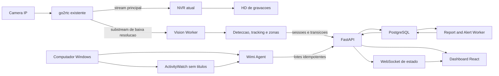

# Wimi Analytics - pesquisa, arquitetura e MVP

Data da pesquisa: 15/08/2026

## Parecer executivo

O produto e tecnicamente viavel, mas nao deve ser incorporado ao processo do
NVR atual. A gravacao e o analytics possuem perfis de falha e consumo muito
diferentes. A arquitetura recomendada preserva o NVR como fonte de video e
gravador, enquanto um servico separado consome apenas um substream de baixa
resolucao, descarta quadros atrasados e publica eventos resumidos.

Decisoes principais:

1. Criar um projeto separado chamado `wimi-analytics`.
2. Preservar integralmente a gravacao direta do NVR via go2rtc.
3. Comecar com identificadores anonimos de tracking, sem reconhecimento facial.
4. Usar ActivityWatch para aplicativo ativo e AFK, removendo titulos de janelas.
5. Nao armazenar quadros, rostos, teclas digitadas, tela ou conteudo do WhatsApp.
6. Persistir sessoes e transicoes, nao uma linha de banco por quadro.
7. Tratar alertas como evidencias para revisao humana, nunca como prova de ma
   conduta ou produtividade.
8. Executar o MVP a 3-5 FPS em substream, com fila limitada e queda de quadros.
9. Manter o banco e os temporarios fora do HD `D:` usado pelas gravacoes.
10. Fazer reconhecimento facial apenas como fase opcional, depois de RIPD,
    definicao de base legal, controles de acesso, retencao e teste de vieses.

O sistema pode ser detalhado, mas nao deve ser secreto. Monitoramento oculto,
keylogger, captura de tela e analise de conversas ampliariam muito o risco sem
ser necessarios para os indicadores operacionais solicitados.

## Encaixe no NVR existente

O NVR atual usa go2rtc e grava o fluxo `/api/stream.ts?src=NOME` sem
transcodificacao continua. O analytics nao deve alterar esse caminho, ler os
arquivos gravados, compartilhar temporarios ou escrever no disco de videos.

Integracao segura:

```text
Camera IP
  |-- stream principal --> go2rtc --> NVR atual --> HD de gravacoes
  `-- substream baixo ----> go2rtc --> Vision Worker --> eventos resumidos
```

Regras de isolamento:

- uma conexao de analytics por camera, preferencialmente no substream;
- `640x360` ou resolucao semelhante no MVP;
- fila de no maximo dois quadros; quadro antigo e descartado;
- o NVR sempre tem prioridade sobre inferencia, relatorios e manutencao;
- falha do analytics nunca reinicia go2rtc, NVR, camera ou Windows;
- nenhuma credencial RTSP e copiada para o banco ou frontend;
- saude do analytics e saude da gravacao aparecem separadas;
- se CPU, memoria, GPU ou disco excederem limites, para-se a inferencia, nao a
  gravacao.

## Pesquisa GitHub

As estrelas sao aproximadas e mudam diariamente. A coluna "ultimo push" usa o
campo `pushed_at` da API publica do GitHub consultada em 15/08/2026. Licenca
permissiva nao elimina a necessidade de preservar avisos, revisar modelos e
validar dependencias transitivas.

### Recomendados

| Classificacao | Repositorio | Stars | Ultimo push | Linguagem / licenca | Qualidade e funcao | Uso comercial e reaproveitamento |
|---|---:|---:|---:|---|---|---|
| Verde - recomendado | [OpenCV](https://github.com/opencv/opencv) | ~90,5k | 15/08/2026 | C++ / Apache-2.0 | Muito alta. Captura, geometria, desenho de zonas e pre-processamento. | Compativel com produto comercial; usar captura, conversao de quadros e operacoes geometricas. |
| Verde - recomendado | [Supervision](https://github.com/roboflow/supervision) | ~49,4k | 14/08/2026 | Python / MIT | Alta e ativa. Inclui ByteTrack, `PolygonZone`, anotadores e utilitarios. | Excelente para tracking e zonas sem copiar implementacoes academicas antigas. |
| Verde - recomendado | [ONNX Runtime](https://github.com/microsoft/onnxruntime) | ~21,4k | 15/08/2026 | C++ / MIT | Muito alta. Inferencia portavel em CPU, CUDA e outros provedores. | Camada principal de inferencia; permite trocar o modelo sem reescrever o pipeline. |
| Verde - recomendado | [RF-DETR](https://github.com/roboflow/rf-detr) | ~9,0k | 15/08/2026 | Python / Apache-2.0 | Alta e muito ativa. Detector moderno com variantes pequenas e exportacao. | Avaliar `Nano` no MVP. Usar apenas pacote e pesos explicitamente Apache; excluir componentes `Plus` sob PML. |
| Verde - recomendado | [ActivityWatch](https://github.com/ActivityWatch/activitywatch) | ~18,6k | 06/08/2026 | Python / MPL-2.0 | Muito alta. Aplicativo ativo, AFK, API heartbeat, consultas e dashboard de referencia. | Comercialmente utilizavel com obrigacoes MPL nos arquivos cobertos. Reusar watchers e semantica de heartbeat. |
| Verde - recomendado | [aw-watcher-window](https://github.com/ActivityWatch/aw-watcher-window) | ~127 | 28/07/2026 | Python / MPL-2.0 | Alta dentro do ecossistema ActivityWatch. Coleta janela ativa no Windows. | Reusar com `exclude_titles` para nao coletar nomes de pacientes, documentos, conversas ou paginas. |
| Verde - recomendado | [OpenVINO](https://github.com/openvinotoolkit/openvino) | ~10,7k | 14/08/2026 | C++ / Apache-2.0 | Muito alta. Otimiza inferencia em CPU, iGPU e NPU Intel. | Provedor alternativo para computadores sem NVIDIA; confirmar AVX2 e versao compativel. |

### Uteis com ressalvas

| Classificacao | Repositorio | Stars | Ultimo push | Linguagem / licenca | Qualidade e funcao | Ressalva |
|---|---:|---:|---:|---|---|---|
| Amarelo - util | [Frigate](https://github.com/blakeblackshear/frigate) | ~35,1k | 15/08/2026 | TypeScript / MIT | Muito alta. NVR local, movimento, deteccao, zonas, restream e editor visual. | Nao instalar como segundo NVR no PC atual. Reusar ideias de motion gating, zonas e UX; avaliar servico separado apenas em Linux dedicado. |
| Amarelo - util | [ByteTrack](https://github.com/FoundationVision/ByteTrack) | ~6,6k | 19/06/2024 | Python / MIT | Referencia academica forte para MOT. | Repositorio original recebe poucos pushes. Preferir a implementacao mantida no Supervision. |
| Amarelo - util | [Norfair](https://github.com/tryolabs/norfair) | ~2,7k | 30/04/2025 | Python / BSD-3-Clause | Boa, leve e modular; aceita detectores diversos e reidentificacao opcional. | Alternativa ao ByteTrack se os testes locais mostrarem melhor estabilidade em baixo FPS. |
| Amarelo - util | [MediaPipe](https://github.com/google-ai-edge/mediapipe) | ~36,6k | 12/08/2026 | C++ / Apache-2.0 | Muito alta para pose e landmarks. | Nao e necessario no MVP. Pose nao prova atendimento ou produtividade e aumenta custo de GPU. |
| Amarelo - util | [PaddleDetection](https://github.com/PaddlePaddle/PaddleDetection) | ~14,4k | 28/05/2026 | Python / Apache-2.0 | Alta, completa e industrial, com deteccao, tracking e pose. | Ecossistema maior e mais pesado; manter como alternativa se RF-DETR nao atender. |
| Amarelo - util | [YOLOX](https://github.com/Megvii-BaseDetection/YOLOX) | ~10,6k | 08/06/2025 | Python / Apache-2.0 | Boa, rapida e com exportacao ONNX/OpenVINO. | O codigo e Apache, mas ha uma questao aberta sobre termos dos pesos oficiais. So usar pesos com licenca confirmada. |
| Amarelo - util | [DeepStream reference apps](https://github.com/NVIDIA-AI-IOT/deepstream_reference_apps) | ~1,4k | 15/07/2026 | C++ / licenca nao detectada pela API | Muito bom para muitas cameras em GPU NVIDIA/Jetson. | Complexidade e dependencia de Linux/NVIDIA excessivas para uma camera no Windows. Revisar termos do SDK e de cada exemplo. |
| Amarelo - util | [CompreFace](https://github.com/exadel-inc/CompreFace) | ~8,2k | 05/10/2024 | Java / Apache-2.0 | API local pronta para reconhecimento facial via Docker. | Ultimo release publico antigo e custo operacional alto. Somente prova controlada depois da governanca biometrica. |

### Nao recomendados para o produto comercial inicial

| Classificacao | Repositorio | Stars | Ultimo push | Linguagem / licenca | Motivo |
|---|---:|---:|---:|---|---|
| Vermelho - nao usar por padrao | [Ultralytics](https://github.com/ultralytics/ultralytics) | ~60,6k | 15/08/2026 | Python / AGPL-3.0 | Excelente tecnicamente, mas um produto proprietario precisa cumprir AGPL ou adquirir licenca Enterprise. Nao assumir que `pip install` autoriza integracao fechada. |
| Vermelho - nao usar por padrao | [BoxMOT](https://github.com/mikel-brostrom/boxmot) | ~8,3k | 13/08/2026 | Python / AGPL-3.0 | Muito ativo e completo, mas traz o mesmo risco de copyleft forte para o produto. |
| Vermelho - nao usar | [Deep SORT](https://github.com/nwojke/deep_sort) | ~6,2k | 02/03/2025 | Python / GPL-3.0 | Implementacao de referencia importante, mas antiga e com GPL. Supervision/ByteTrack ou Norfair sao melhores escolhas. |
| Vermelho - nao usar pesos padrao | [InsightFace](https://github.com/deepinsight/insightface) | ~29,5k | 27/07/2026 | Python / licenca dividida | O codigo e MIT, mas os modelos fornecidos sao declarados apenas para pesquisa nao comercial e exigem licenciamento separado. |

## Escolha de stack

| Componente | Escolha | Motivo |
|---|---|---|
| Ingestao de camera | go2rtc existente, substream somente leitura | Nao cria nova fonte de credenciais e preserva a gravacao atual. |
| Vision Worker | Python isolado | Melhor ecossistema para OpenCV, ONNX e tracking; processo pode ser encerrado sem afetar o NVR. |
| Detector inicial | RF-DETR Nano, pesos Apache-designados, exportado para ONNX | Licenca mais adequada ao produto e modelo pequeno para teste em GPU de 4 GB. |
| Inferencia | ONNX Runtime com adaptadores CUDA, DirectML e CPU | Permite GPU NVIDIA e fallback sem acoplar o dominio a um fornecedor. |
| Tracking | Supervision ByteTrack | Implementacao ativa, MIT e integrada a estruturas de deteccao e zonas. |
| Zonas | Supervision `PolygonZone` + histerese propria | Base pronta; a regra de negocio ainda precisa usar tempo real e tolerar bordas. |
| Telemetria de apps | ActivityWatch `aw-watcher-window` + `aw-watcher-afk` | Evita reinventar coleta de janela ativa e ociosidade. |
| Eventos Windows ausentes | Pequeno Windows Service em .NET LTS | Captura lock/unlock, login/logout, fila offline e envio autenticado. |
| Backend | FastAPI + SQLAlchemy/Alembic | Contratos claros, validacao, WebSocket e alinhamento com o worker Python. |
| Banco | PostgreSQL | Integridade, indices, JSONB controlado, agregacoes e crescimento para varias lojas. |
| Jobs | Worker com lease no PostgreSQL | Evita Redis/Celery no MVP; relatorios e alertas continuam idempotentes. |
| Frontend | React + TypeScript + Vite | Painel local nao precisa SSR/SEO do Next.js; menor complexidade operacional. |
| Graficos | ECharts | Bom suporte a timeline, barras empilhadas e heatmaps operacionais. |
| Implantacao | Servicos separados; Compose somente no servidor dedicado | No PC atual, containers adicionais competiriam com o NVR e a RAM disponivel. |

O detector deve ficar atras de uma interface. Antes de fixa-lo, executar o
mesmo conjunto de videos de validacao em RF-DETR Nano, YOLOX Nano com pesos
legalmente confirmados e uma opcao OpenVINO. A decisao final usa precisao local,
latencia, memoria, temperatura e licenca, nao apenas benchmark publico.

## Arquitetura recomendada



### Fluxo de visao

1. O worker le o substream e mantem apenas o quadro mais recente.
2. O detector localiza pessoas em 3-5 FPS.
3. O tracker gera um identificador efemero por camera.
4. As coordenadas do ponto dos pes sao comparadas com zonas normalizadas.
5. Histerese evita entrar e sair repetidamente na borda.
6. O worker cria sessoes de zona e movimento usando relogio monotonicamente
   crescente; FPS nao e usado para calcular duracao.
7. Apenas inicio, heartbeat resumido, mudanca de zona, fim e saude sao enviados.
8. O backend deduplica pelo `source_event_id`.

### Fluxo do computador

1. ActivityWatch coleta aplicacao ativa e AFK localmente.
2. `exclude_titles` remove titulos de janela antes da persistencia/exportacao.
3. O agente complementa lock/unlock, login/logout e identidade do dispositivo.
4. Eventos sao agregados em segmentos contiguos por aplicacao/categoria.
5. Em queda de rede, o agente usa fila local limitada, criptografada e com TTL.
6. O backend recebe lotes assinados e idempotentes.

### Correlacao camera-computador

A correlacao deve ser explicitamente probabilistica:

- a zona do computador deve conter exatamente uma pessoa por uma janela minima;
- a maquina deve estar desbloqueada e com atividade recente;
- o horario dos dispositivos deve estar sincronizado;
- sobreposicao de duas pessoas, oclusao ou camera offline gera `inconclusivo`;
- o resultado guarda evidencias, confianca e versao da regra;
- nunca converter automaticamente correlacao em registro de ponto ou sancao.

## Identidade e reconhecimento facial

### Recomendacao para o MVP

Usar `anonymous_track_id` e, quando necessaria a atribuicao a uma pessoa,
combinar uma destas fontes menos invasivas:

- login do Windows em computador individual;
- escala/turno informado no sistema;
- cracha QR/NFC apresentado no inicio do turno;
- associacao manual revisavel no dashboard.

Um ID de tracking nao e uma identidade permanente. Ele pode mudar apos oclusao,
reinicio, mudanca de camera ou ausencia longa. O sistema deve somar sessoes com
essa incerteza explicita.

### Fase biometrica opcional

Reconhecimento facial so entra depois de:

1. RIPD documentado;
2. finalidade e hipotese legal validadas por profissional responsavel;
3. aviso claro aos titulares e canal de exercicio de direitos;
4. alternativa operacional nao biometrica;
5. embeddings criptografados e separados do banco operacional;
6. nenhum recorte facial persistido por padrao;
7. teste de falso positivo, falso negativo e vies por pessoa/iluminacao;
8. limiar conservador e resultado `desconhecido` como comportamento normal;
9. revisao humana antes de qualquer associacao;
10. politica de exclusao ao fim do vinculo e auditoria de acesso.

Biometria facial vinculada a uma pessoa natural e dado pessoal sensivel pela
LGPD. A ANPD tambem destaca risco de erro, discriminacao, falta de transparencia
e seguranca. Portanto, "funcionar localmente" reduz exposicao, mas nao elimina
as obrigacoes de finalidade, necessidade, transparencia, seguranca e prevencao.

## WhatsApp pessoal versus corporativo

Somente o nome do aplicativo em primeiro plano nao revela a finalidade do uso.
Se a mesma conta ou o mesmo executavel serve para conversas pessoais e da
farmacia, nao existe classificacao tecnica confiavel sem analisar conteudo.

Solucao recomendada:

1. usar WhatsApp Business corporativo em dispositivo ou perfil de navegador
   gerenciado e separado;
2. classificar pelo dispositivo, perfil e aplicativo, nao pelo texto da conversa;
3. marcar sessoes fora desse contexto como `WhatsApp - nao classificado`;
4. permitir correcao manual e registrar quem alterou a classificacao;
5. nunca capturar mensagens, contatos, notificacoes, teclas ou tela.

Uma regra que diga "WhatsApp aberto = uso pessoal" e tecnicamente falsa. O
dashboard deve mostrar tempo observado e contexto conhecido, sem inferir motivo.

## Celular fisico

Detectar um telefone pequeno na mao por camera de teto e suscetivel a oclusao,
distancia e falsos positivos. Nao incluir "tempo de celular" no primeiro MVP.
Numa fase posterior, pode-se gerar eventos de baixa confianca de `telefone
visivel`, com revisao humana e sem converter deteccoes intermitentes em duas
horas continuas de uso.

## Modelo de dados

Todos os horarios devem ser `timestamptz` em UTC. Poligonos usam coordenadas
normalizadas de `0.0` a `1.0`. Identificadores externos usam UUID e toda ingestao
possui chave de idempotencia.

### Cadastros

- `employees`: pessoa, situacao e referencia interna; sem biometria.
- `devices`: computador, agente, loja, versao e ultima comunicacao.
- `cameras`: nome logico e referencia ao stream; sem URL/credencial no banco.
- `zones`: camera, nome, poligono, tipo, versao e vigencia.
- `shifts`: escala planejada, inicio, fim e origem.
- `app_categories`: regra versionada que agrupa processos em categorias.

### Eventos e sessoes

- `source_events`: envelope idempotente, origem, sequencia, horario e payload
  minimo; retencao curta.
- `track_sessions`: tracking anonimo por camera, inicio, fim e qualidade.
- `presence_sessions`: intervalo detectado e nivel de confianca.
- `zone_sessions`: entrada, saida, duracao, zona e qualidade.
- `movement_segments`: movendo/parado/desconhecido, sem coordenadas por quadro.
- `computer_sessions`: login, unlock, lock, logout e estado do dispositivo.
- `app_usage_segments`: processo normalizado, categoria, inicio, fim e origem.
- `identity_links`: associacao revisavel entre tracking e pessoa, com metodo e
  confianca.
- `correlation_events`: sobreposicao camera-computador e evidencias da regra.
- `device_health`: fila, latencia, memoria, CPU/GPU, frames descartados e erros.

### Resultados e governanca

- `alerts`: regra, evidencia, estado de revisao e responsavel.
- `daily_metrics`: agregados diarios reproduziveis e versao do calculo.
- `reports`: periodo, versao, status e referencia ao agregado; nao PDF binario no
  banco por padrao.
- `audit_log`: login, consulta sensivel, exportacao, alteracao e decisao humana.
- `retention_policies`: prazo por categoria de dado.
- `privacy_requests`: acesso, correcao, bloqueio ou eliminacao quando aplicavel.

### O que nao deve existir no MVP

- tabela de coordenadas por quadro;
- armazenamento continuo de bounding boxes;
- screenshots ou gravacao duplicada;
- conteudo de janela, URL, mensagem ou tecla;
- score unico de "produtividade" por funcionario;
- exclusao em cascata sem auditoria;
- embeddings faciais misturados aos eventos operacionais.

## Estrutura do novo projeto

```text
wimi-analytics/
|-- apps/
|   |-- api/                    # FastAPI e contratos REST/WebSocket
|   `-- web/                    # React, TypeScript e Vite
|-- services/
|   |-- vision-worker/          # captura, detector, tracker e zonas
|   `-- report-worker/          # agregacao, alertas e relatorios
|-- agents/
|   `-- windows/                # servico, ActivityWatch bridge e fila offline
|-- packages/
|   |-- contracts/              # schemas versionados de eventos
|   |-- rules/                  # correlacao e alertas deterministas
|   `-- privacy/                # redacao, retencao e classificacao de dados
|-- migrations/                 # Alembic
|-- infra/
|   |-- compose/                # servidor local dedicado
|   `-- windows/                # instalacao e servicos do agente/vision
|-- tests/
|   |-- fixtures/               # videos sinteticos ou consentidos
|   |-- integration/
|   `-- hardware/
`-- docs/
    |-- architecture/
    |-- privacy/
    |-- runbooks/
    `-- decisions/
```

O NVR continua em seu repositorio atual. A unica integracao permitida e um
contrato de stream e saude somente leitura, versionado e testado.

## MVP recomendado

### Escopo funcional

1. Uma camera e um substream.
2. Deteccao apenas da classe `person`.
3. Tracking anonimo.
4. Editor de zonas e tempo por zona.
5. Presenca, ausencia e parado/movendo com estado `desconhecido`.
6. Um computador Windows.
7. Aplicacao ativa, AFK, lock/unlock e login/logout.
8. Categorias `Sistema Farmacia`, `WhatsApp`, `Navegador` e `Outros`.
9. Dashboard de estado atual, timeline e relatorio diario.
10. Alertas revisaveis, desativados por padrao ate calibracao.

### Fora do MVP

- reconhecimento facial;
- reconhecimento de postura ou atividade;
- leitura de tela, navegador, mensagens ou teclado;
- tempo de celular fisico;
- comparacao/ranking entre funcionarios;
- relatorios semanais/mensais avancados;
- varias lojas;
- notificacoes disciplinares automaticas.

### Etapas

#### Etapa 0 - governanca e benchmark

- definir finalidade, acesso, retencao e comunicado interno;
- selecionar cinco videos curtos e consentidos para validacao;
- medir RF-DETR Nano e alternativas no hardware real;
- estabelecer limites de CPU, RAM, GPU, temperatura e FPS;
- confirmar que ActivityWatch exclui titulos antes de armazenar/enviar.

#### Etapa 1 - fundacao

- schemas de eventos e migracoes;
- autenticacao de dispositivos e RBAC;
- fila idempotente;
- health endpoints e auditoria;
- simuladores de camera e agente para testes sem equipamento real.

#### Etapa 2 - visao

- substream, deteccao, tracking e zonas;
- maquina de estados com histerese;
- reconexao independente e descarte de backlog;
- metricas de qualidade e frames descartados.

#### Etapa 3 - computador e correlacao

- ActivityWatch com privacidade;
- lock/unlock e fila offline;
- segmentos por aplicacao;
- correlacao probabilistica com zona do computador.

#### Etapa 4 - painel e relatorio

- visao geral operacional;
- timeline por pessoa anonima/dispositivo;
- editor de zonas;
- relatorio diario e revisao de alertas;
- exportacao auditada.

## Regras de logica

### Presenca

- entrada exige duas ou mais deteccoes validas dentro de uma janela curta;
- saida usa periodo de graca para oclusao e perda de quadros;
- camera offline fecha a confianca, nao inventa uma saida;
- reinicio do worker abre lacuna explicita;
- ausencia de deteccao nao significa ausencia fisica com certeza.

### Zona

- usar ponto dos pes ou ancora inferior, nao o centro da caixa;
- exigir permanencia minima antes de confirmar entrada;
- aplicar margem interna/externa diferente para evitar oscilacao na borda;
- uma pessoa pode estar em uma zona primaria e zonas logicas sobrepostas, mas a
  regra de agregacao deve impedir dupla contagem de tempo total.

### Movimento e inatividade

- normalizar deslocamento pela diagonal da imagem e pelo intervalo de tempo;
- filtrar jitter do tracker;
- `parado` descreve deslocamento, nao trabalho;
- `sentado`, `atendendo` e `usando computador` ficam `desconhecido` sem evidencia
  suficiente;
- alertas usam janela, severidade, confianca e cooldown.

### Aplicativos

- medir apenas tempo em primeiro plano;
- unir heartbeats adjacentes com tolerancia curta;
- lock/AFK interrompe tempo ativo;
- falha do agente gera lacuna, nao completa o intervalo por suposicao;
- regras de categoria sao versionadas para reproduzir relatorios antigos.

### Relatorios

- total de presenca nunca supera a cobertura observavel sem explicacao;
- soma das zonas exclusivas nao supera a presenca;
- `atividade observada` e `produtividade` nao sao sinonimos;
- toda metrica mostra cobertura de dados e periodo inconclusivo;
- qualquer correcao humana preserva valor anterior, autor, motivo e horario.

## Dashboard e design

O painel deve ter aparencia operacional, densa e calma, nao uma pagina de
marketing nem uma colecao de cards decorativos.

### Navegacao

- `Agora`: cameras, agentes, pessoas detectadas e saude das fontes;
- `Timeline`: presenca, zonas, computador e lacunas em uma linha temporal;
- `Pessoas`: relatorios individuais com confianca e cobertura;
- `Zonas`: editor sobre frame estatico autorizado e metricas por area;
- `Relatorios`: diario, semanal e mensal;
- `Alertas`: fila de revisao humana;
- `Sistema`: dispositivos, retencao, privacidade, auditoria e saude.

### Principios visuais

- status sempre combina cor, texto e icone;
- estados `online`, `degradado`, `offline` e `inconclusivo` sao distintos;
- graficos mostram lacunas, nao linhas continuas inventadas;
- tooltip explica definicao, versao e cobertura de cada indicador;
- nenhuma tela chama falta de movimento de ociosidade ou improdutividade;
- filtros e periodo ficam persistentes durante a navegacao;
- editor de zona tem desfazer, refazer, nomes, cor, teste e validacao de poligono;
- telas funcionam em desktop e tablet, com tabela e timeline sem sobreposicao.

## Seguranca, privacidade e retencao

- servicos escutam somente nas interfaces necessarias;
- agentes recebem identidade e chave exclusivas por dispositivo;
- comunicacao usa TLS e autenticacao mutua ou tokens curtos rotacionaveis;
- segredos ficam em DPAPI/Windows Credential Manager ou secret store local;
- RBAC separa operador, gestor, auditor e administrador;
- consultas individuais e exportacoes entram no `audit_log`;
- backups sao criptografados, testados e possuem prazo;
- nenhum dado sai para nuvem por padrao;
- imagens nao entram em logs, traces ou ferramentas de erro;
- eventos brutos possuem retencao curta; agregados podem ter prazo maior;
- exclusao e alteracao de politicas exigem confirmacao e trilha de auditoria;
- modelos e dependencias ficam fixados por hash, com SBOM e verificacao de
  licenca no CI.

Uma politica inicial conservadora para discussao:

| Dado | Retencao inicial |
|---|---:|
| Quadros e recortes | zero por padrao |
| Eventos brutos e segmentos | 30 dias |
| Alertas revisados | 90 dias |
| Agregados diarios | 12 meses |
| Logs tecnicos sem dados pessoais | 30 dias |
| Fila offline do agente | 7 dias ou limite de tamanho, o que ocorrer primeiro |
| Biometria | nao coletar no MVP |

Os prazos finais dependem da finalidade e da avaliacao juridica; nao devem ser
copiados automaticamente para producao.

## Hardware atual e impacto esperado

Snapshot local em 15/08/2026:

- Intel Core i7-7700, 4 nucleos e 8 threads;
- 15,9 GB de RAM, com aproximadamente 5,1 GB livres no momento da coleta;
- NVIDIA GeForce GTX 1050 Ti, 4 GB, driver `582.28`;
- GPU a 36 C, aproximadamente 689 MB usados e 4% de utilizacao na coleta;
- `C:` com 90,4 GB livres;
- `D:` com 824,5 GB livres, reservado para gravacoes;
- `E:` FAT32/USB nao deve hospedar banco ou fila operacional.

Esse hardware deve conseguir provar uma camera pequena em 3-5 FPS, mas nao e
prudente prometer operacao 24h do NVR, banco, frontend, agente e visao sem um
ensaio medido. A GTX 1050 Ti e suficiente para um modelo pequeno, mas os 4 GB de
VRAM e a RAM livre limitam containers e modelos maiores.

Recomendacao:

1. prototipo curto no PC atual, com inferencia em processo separado;
2. nunca usar `D:` para banco, cache de modelo ou frames;
3. limitar fila e memoria, sem swap proposital para compensar vazamento;
4. medir temperatura, CPU, RAM, VRAM, frames e impacto na gravacao;
5. para producao 24h, preferir um computador dedicado ao analytics;
6. nao iniciar teste de 24h enquanto novos eventos USBXHCI/Kernel 144 estiverem
   aparecendo.

## Criterios de aceite do MVP

### Integridade do NVR e hardware

- nenhuma alteracao no arquivo gravado, no ciclo de retencao ou no processo do
  NVR;
- nenhum video vazio ou bloco interrompido atribuivel ao analytics;
- zero escrita do analytics no HD de gravacoes;
- nenhuma nova ocorrencia `Kernel_144`, desconexao do HD ou reset de disco no
  ensaio;
- ao ultrapassar limites, Vision Worker entra em `degradado` ou para, e o NVR
  continua.

### Visao

- queue depth nunca cresce sem limite;
- recuperacao automatica apos perda e retorno do substream;
- reinicio nao duplica sessoes nem inventa tempo;
- duracao por zona dentro de erro acordado contra video anotado;
- falsos positivos e falsos negativos documentados por iluminacao e oclusao;
- camera offline e lacuna de dados aparecem no relatorio.

### Computador

- total por aplicativo confere com um roteiro controlado;
- AFK, lock e logout interrompem a sessao corretamente;
- reenviar o mesmo lote nao duplica tempo;
- queda de rede preserva fila dentro do limite e descarta de forma auditavel
  apenas depois do TTL;
- banco e API nao contem titulo de janela, URL, mensagem ou tecla.

### Produto

- relatorio diario e reproduzivel a partir dos eventos e da versao das regras;
- toda metrica exibe cobertura e confianca;
- alerta pode ser confirmado, descartado ou comentado por pessoa autorizada;
- exportacao e acesso individual entram na auditoria;
- nenhum indicador isolado e rotulado como produtividade ou ma conduta.

## Plano de validacao

1. testes unitarios das maquinas de estado de presenca, zona, AFK e alertas;
2. testes contra falsos alertas, oclusao, borda de zona e relogio alterado;
3. teste de contrato entre Vision Worker, agente e API;
4. teste de idempotencia, fila offline, restart e banco indisponivel;
5. videos sinteticos e consentidos, nunca o acervo real;
6. benchmark de 30 minutos sem camera real usando video de teste;
7. baseline do NVR e hardware;
8. ensaio real controlado de 30-180 segundos;
9. ensaio supervisionado de 8 horas apos estabilidade;
10. somente depois, piloto de 72 horas; teste de 24h/7 deve ser planejado e
    monitorado, nao presumido.

## Decisao recomendada

Prosseguir com um MVP separado e anonimo, usando:

```text
go2rtc substream
  + OpenCV
  + RF-DETR Nano via ONNX Runtime
  + Supervision ByteTrack/PolygonZone
  + ActivityWatch com titulos excluidos
  + Wimi Agent para eventos Windows e fila
  + FastAPI
  + PostgreSQL
  + React/Vite
```

Frigate serve como excelente referencia de arquitetura e UX, mas nao deve ser
instalado ao lado do NVR atual no mesmo PC. Ultralytics, BoxMOT, Deep SORT e os
pesos padrao do InsightFace ficam fora do MVP por licenca. Reconhecimento facial
fica como decisao futura separada, porque e tecnicamente possivel, mas altera de
forma material o risco juridico, de seguranca e de erro do produto.

## Fontes principais

- [ActivityWatch](https://github.com/ActivityWatch/activitywatch)
- [aw-watcher-window](https://github.com/ActivityWatch/aw-watcher-window)
- [OpenCV](https://github.com/opencv/opencv)
- [Supervision](https://github.com/roboflow/supervision)
- [RF-DETR](https://github.com/roboflow/rf-detr)
- [ONNX Runtime](https://github.com/microsoft/onnxruntime)
- [Frigate](https://github.com/blakeblackshear/frigate)
- [ByteTrack](https://github.com/FoundationVision/ByteTrack)
- [Norfair](https://github.com/tryolabs/norfair)
- [OpenVINO](https://github.com/openvinotoolkit/openvino)
- [MediaPipe](https://github.com/google-ai-edge/mediapipe)
- [PaddleDetection](https://github.com/PaddlePaddle/PaddleDetection)
- [YOLOX](https://github.com/Megvii-BaseDetection/YOLOX)
- [DeepStream reference apps](https://github.com/NVIDIA-AI-IOT/deepstream_reference_apps)
- [Ultralytics](https://github.com/ultralytics/ultralytics)
- [InsightFace](https://github.com/deepinsight/insightface)
- [CompreFace](https://github.com/exadel-inc/CompreFace)
- [LGPD - Lei 13.709/2018](https://www.planalto.gov.br/ccivil_03/_ato2015-2018/2018/lei/l13709compilado.htm)
- [ANPD - Relatorio de Impacto a Protecao de Dados](https://www.gov.br/anpd/pt-br/canais_atendimento/agente-de-tratamento/relatorio-de-impacto-a-protecao-de-dados-pessoais-ripd)
- [ANPD - biometria e reconhecimento facial](https://www.gov.br/anpd/pt-br/centrais-de-conteudo/documentos-tecnicos-orientativos/radar-tecnologico-biometria-anpd-1.pdf)
